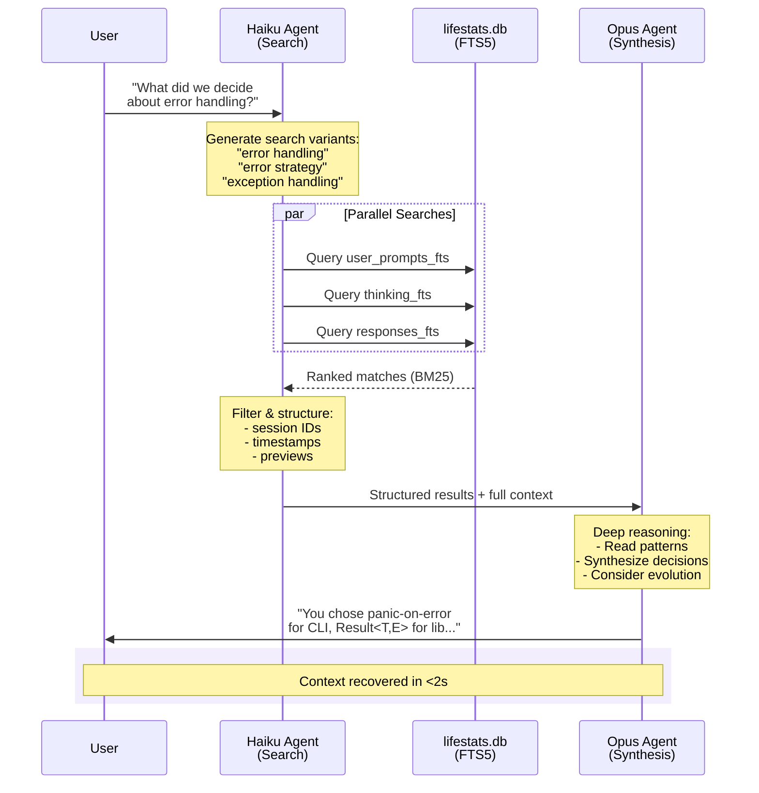

Long Claude Code sessions are wonderful until they aren't.

You're *vibing*. Iterating rapidly. Claude knows you, knows what you're building, knows the quirky details. There's no friction. You're in flow state together.

Then you see it: **10% context remaining**. Compaction is coming.

You scramble. Export summaries to `.claude/temporal-context/`. Save the work. But you know what's coming. Old Claude—the one who understood the vibe, who remembered the branches you explored, who knew why you hated "vomit green" block backgrounds in Solarized—is about to disappear.

New Claude arrives. Eager to help. But the momentum is gone. You try to recreate it, but how do you remember *exactly* what you said? What tangents led you here? The creative flow state is broken.

Context compaction happened.

## The jq Archaeology Workflow

Here's a real example. I'd been vibing with Claude on theme design. We created "Spy Dark"—the official Aspy theme, inspired by what I like, tailored to how I wanted the proxy to look. I was detailed, descriptive. Claude caught the vibe. *Really well*.

Then life happened. Real work. Weeks pass. I return to create "Spy Light" as a companion. But the session is gone—lost in a sea of sessions. What were my notes? What did I *say* about Solarized?

The archaeology begins:

```bash
jq 'select(.type == "Thinking") | select(.content | contains("solarized"))' \
  logs/session-xyz.jsonl
```

(If you're a Windows user, figuring out jq can be tricky. I barely know how to jq—Claude had to help me search.)

We find it. New Claude reads it back to me, word for word: "vomit green for block backgrounds," "didn't like the 90s mIRC feel," all the quirky details that made Spy Dark *mine*.

Armed with that context, I ask: "Can you help me create Spy Light?"

Claude one-shotted it.

It worked. But it was tedious.

```mermaid
graph TD
    CF[Claude Forgets Context] -->|Human notices| DT[Drop to Terminal]
    DT -->|Run jq query| JQ[Search JSONL Logs]
    JQ -->|Find relevant blocks| CP[Copy Paste]
    CP -->|Feed back to Claude| CR[Claude Remembers]

    style CF fill:#ef4444,stroke:#dc2626,color:#fff
    style CR fill:#10b981,stroke:#059669,color:#fff
    style JQ fill:#27272a,stroke:#71717a
    style CP fill:#f59e0b,stroke:#d97706,color:#000

    DT -.->|5-10 minutes| CP
```


<p style="text-align: center; font-size: 0.9em; color: #a1a1aa; margin-top: -10px;"><em>The old way: manual context archaeology</em></p>

But here's the thing—it *validated* that the solution existed in the data. Every insight, every decision, every nuance of our collaboration was sitting right there in those JSONL files. The problem wasn't missing information. The problem was retrieval.

## Enter the Event Pipeline

The new architecture introduces an extensible event processing pipeline. Every event that flows through Aspy—tool calls, thinking blocks, API usage, user prompts—now passes through a chain of processors before reaching its destinations.

```mermaid
graph LR
    PE[ProxyEvent] --> EP[EventPipeline]
    EP --> P1[RedactionProcessor]
    P1 --> P2[LifestatsProcessor]
    P2 --> P3[MetricsProcessor]
    P3 --> SE[send_event]
    SE --> TUI[TUI Display]
    SE --> API[REST API]
    SE --> JSONL[JSONL Logs]

    P2 -.->|writes to| DB[(SQLite<br/>lifestats.db)]

    style EP fill:#6366f1,stroke:#4f46e5,stroke-width:3px,color:#fff
    style P1 fill:#27272a,stroke:#52525b
    style P2 fill:#8b5cf6,stroke:#6366f1
    style P3 fill:#27272a,stroke:#52525b
    style DB fill:#3f3f46,stroke:#71717a
```


<p style="text-align: center; font-size: 0.9em; color: #a1a1aa; margin-top: -10px;"><em>Events flow through processors before reaching their destinations</em></p>

Processors can:
- **Transform**: Modify events (redaction, enrichment)
- **Filter**: Drop events (by type, content, or condition)
- **Side-effect**: React without modification (storage, metrics, webhooks)

The pipeline itself is kernel-level infrastructure. But the interesting processors—that's userland. Toggleable via config. Non-invasive to the core.

This is Aspy's fundamental design principle: **kernel/userland separation**. Like Linux, the kernel provides stable infrastructure while userland features compose on top. Future processors can add semantic analysis (local models, remote inference, or Aspy-provided embeddings), custom metrics, webhooks—all without touching the kernel.

```mermaid
graph TB
    subgraph "Kernel (Stable)"
        EP[EventPipeline]
        SE[send_event]
    end

    subgraph "Userland (Pluggable)"
        P1[RedactionProcessor]
        P2[LifestatsProcessor<br/>✅ Shipping]
        P3[MetricsProcessor]
        P4[SemanticAnalyzer<br/>🔮 Future]
        P5[WebhookProcessor<br/>🔮 Future]
    end

    subgraph "Semantic Analysis Options"
        L[Local Models<br/>Ollama, llama.cpp]
        R[Remote APIs<br/>OpenAI, Anthropic]
        A[Aspy Embeddings<br/>Custom trained]
    end

    EP --> P1
    P1 --> P2
    P2 --> P3
    P3 --> P4
    P4 --> P5
    P5 --> SE

    P4 -.->|inference| L
    P4 -.->|inference| R
    P4 -.->|inference| A

    style EP fill:#6366f1,stroke:#4f46e5,stroke-width:3px,color:#fff
    style P2 fill:#8b5cf6,stroke:#6366f1
    style P4 fill:#3f3f46,stroke:#71717a,stroke-dasharray: 5 5
    style P5 fill:#3f3f46,stroke:#71717a,stroke-dasharray: 5 5
    style L fill:#27272a,stroke:#52525b
    style R fill:#27272a,stroke:#52525b
    style A fill:#27272a,stroke:#52525b
```


<p style="text-align: center; font-size: 0.9em; color: #a1a1aa; margin-top: -10px;"><em>Extensible architecture: kernel infrastructure + pluggable userland processors</em></p>

The roots from which the tree grows.

## Lifestats: The Memory Layer

The first processor to ship is `LifestatsProcessor`. It writes events to a SQLite database optimized for one thing: context recovery queries.

Not just storage. *Queryable* storage.

The schema captures the complete conversation triad:

```mermaid
graph LR
    U[UserPrompt<br/>What I asked] --> T[Thinking<br/>Claude's reasoning]
    T --> A[AssistantResponse<br/>Claude's answer]

    U -.->|FTS5 Index| DB1[(user_prompts_fts)]
    T -.->|FTS5 Index| DB2[(thinking_fts)]
    A -.->|FTS5 Index| DB3[(responses_fts)]

    style U fill:#3f3f46,stroke:#71717a
    style T fill:#8b5cf6,stroke:#6366f1
    style A fill:#3f3f46,stroke:#71717a
    style DB1 fill:#27272a,stroke:#52525b
    style DB2 fill:#27272a,stroke:#52525b
    style DB3 fill:#27272a,stroke:#52525b
```


<p style="text-align: center; font-size: 0.9em; color: #a1a1aa; margin-top: -10px;"><em>The complete conversation triad, indexed for full-text search</em></p>

The schema includes:
- **User prompts** with full-text search (what you asked)
- **Thinking blocks** with full-text search (Claude's reasoning)
- **Assistant responses** with full-text search (Claude's answers)
- **Tool calls** with duration tracking
- **API usage** with cost calculation
- **Session boundaries** with aggregated statistics

All indexed. All searchable. All sitting in `./data/lifestats.db` ready to be queried.

```sql
SELECT content, timestamp
FROM thinking_fts
WHERE thinking_fts MATCH '"theme" AND "solarized"'
ORDER BY bm25(thinking_fts)
LIMIT 5;
```

That jq archaeology workflow? Now it's a millisecond query.

## The Two-Agent Pattern

Here's where it gets interesting.

The lifestats database exposes itself through MCP tools. Claude can query its own past context directly—no terminal diving, no copy-paste, no human in the middle.

But there's a subtlety to how this works best.

Searching through past conversations is a *different* task than synthesizing meaning from those conversations. Search is fast, cheap, and tolerates multiple attempts. Synthesis requires deep reasoning. Mixing them is inefficient.

So we split the work:


<p style="text-align: center; font-size: 0.9em; color: #a1a1aa; margin-top: -10px;"><em>Fast search (Haiku) + deep understanding (Opus) = efficient context recovery</em></p>

Haiku handles the retrieval. It takes your fuzzy query—*"what did we decide about error handling?"*—and executes parallel searches with different keywords. It filters, ranks, and returns structured matches: session IDs, timestamps, content previews.

Then Opus reads the full context and does what it does best: understand.

The result is context recovery that feels almost magical. You ask Claude about something from three sessions ago, and it *remembers*—not because the context window held that information, but because it queried its own past.

**Validation Note:** This two-agent pattern isn't theoretical—we validated it with `agents/recover.md` using the existing `aspy_search` MCP tool. Semantic queries ("what did we decide about themes?") significantly outperformed keyword commands, though current JSONL searches return noisy results. With lifestats FTS5 and BM25 ranking, Haiku's parallel search strategies will become far more precise.

## When Recovery Prevents Regression

Here's another real example of what this enables.

I'm refactoring the entire codebase—six phases of work to fix code smell and prevent `app.rs` from becoming a 1200-line monster. We establish patterns: composition via traits, kernel/userland separation, "one concept, one place" discoverability.

We finish Phase 6. Claude's excited: *"Refactor complete!"*

Then compaction hits.

I request one small modification. What does New Claude do? Immediately suggests adding code to `app.rs`—the exact anti-pattern we just spent hours preventing.

"Claude, what are you doing? We just finalized the specification plan which was to NOT do this."

*"OH! You're absolutely right."*

With lifestats, that doesn't happen. Claude queries its past reasoning, sees the architectural decisions, understands the *why* behind the patterns. The regression never occurs. The vibe continues.

## Non-Blocking by Design

One architectural decision worth highlighting: the storage processor uses a dedicated OS thread, not a tokio task.

SQLite doesn't play well with async runtimes. Blocking I/O in an async context is a recipe for latency spikes. So the processor sends events to a bounded channel, and a separate thread handles batched writes with WAL mode enabled.

```mermaid
graph TB
    subgraph "Tokio Async Runtime"
        EP[Event Pipeline] --> LP[LifestatsProcessor]
        LP -->|try_send non-blocking| BC[Bounded Channel<br/>cap: 10000]
    end

    subgraph "Dedicated OS Thread"
        BC -.->|recv blocking| WT[Writer Thread]
        WT -->|batch writes| TXN[Transaction Batch<br/>50 events]
        TXN -->|commit| DB[(SQLite<br/>WAL mode)]
    end

    LP -.->|if full| M[Metrics:<br/>events_dropped++]

    style EP fill:#27272a,stroke:#52525b
    style LP fill:#8b5cf6,stroke:#6366f1
    style BC fill:#3f3f46,stroke:#71717a
    style WT fill:#10b981,stroke:#059669
    style DB fill:#3f3f46,stroke:#71717a
    style M fill:#ef4444,stroke:#dc2626,color:#fff
```


<p style="text-align: center; font-size: 0.9em; color: #a1a1aa; margin-top: -10px;"><em>Channel-based threading: async pipeline stays responsive while SQLite writes happen on dedicated thread</em></p>

The pipeline never blocks. Events continue flowing. If the writer falls behind, we track backpressure metrics rather than silently dropping data.

```rust
fn process(&self, event: &ProxyEvent, ctx: &ProcessContext) -> ProcessResult {
    match self.tx.try_send(WriterCommand::Store(event.clone(), ctx.clone())) {
        Ok(()) => { /* queued */ }
        Err(TrySendError::Full(_)) => {
            self.metrics.events_dropped.fetch_add(1, Ordering::Relaxed);
            tracing::warn!("Lifestats backpressure: dropped event");
        }
        // ...
    }
    ProcessResult::Continue  // Always pass through
}
```

Observability tools should be invisible. They shouldn't introduce latency. They definitely shouldn't lose your data without telling you.

## The Bigger Picture

This isn't just about recovering from context compaction—though that's the immediate motivation.

It's about **context ownership**. Context recall. Context management. Context diffing. Aspy takes ownership of context to optimize developer workflows—to bridge the gap between "Old Claude" and "New Claude," to enhance perceived continuity, to reduce sudden interruptions in mental flow state.

Your coding sessions leave traces. Decisions accumulate. Patterns emerge. Creative tangents that led somewhere important. Quirky preferences that make the work *yours*. With lifestats, that history becomes queryable infrastructure.

```mermaid
graph TB
    subgraph "Before: Manual Archaeology"
        QF1[Question] -->|5-10 min| M1[Manual jq searches]
        M1 --> CP[Copy/paste context]
        CP --> A1[Answer]
    end

    subgraph "After: Automated Memory"
        QF2[Question] -->|less than 2 sec| LS[Lifestats MCP Query]
        LS --> R[Ranked Results]
        R --> A2[Answer]
    end

    subgraph "Query Capabilities"
        LS --> Q1[Context Recovery<br/>What did we decide?]
        LS --> Q2[Performance Analysis<br/>Which tools are slow?]
        LS --> Q3[Cost Tracking<br/>API usage last month?]
        LS --> Q4[Pattern Discovery<br/>Every auth discussion]
    end

    style QF1 fill:#27272a,stroke:#52525b
    style QF2 fill:#27272a,stroke:#52525b
    style M1 fill:#f59e0b,stroke:#d97706,color:#000
    style LS fill:#8b5cf6,stroke:#6366f1
    style Q1 fill:#3f3f46,stroke:#71717a
    style Q2 fill:#3f3f46,stroke:#71717a
    style Q3 fill:#3f3f46,stroke:#71717a
    style Q4 fill:#3f3f46,stroke:#71717a
```


<p style="text-align: center; font-size: 0.9em; color: #a1a1aa; margin-top: -10px;"><em>From manual archaeology to queryable memory infrastructure</em></p>

Want to know which tools are slowest across all your sessions? Query it.

Want to track your API costs over the past month? Query it.

Want to find every time you discussed "authentication" in any session ever? You guessed it. Query it.

The JSONL files remain—they're the source of truth, the raw observability layer. The SQLite storage is an optimization layer on top, designed for the queries that matter most.

## What's Next

The lifestats system ships in phases:

1. **Core pipeline** - Event processing infrastructure
2. **Storage foundation** - SQLite with FTS5 and connection pooling
3. **Query interface** - HTTP API and MCP tools
4. **Agent layer** - Recovery and analysis workflows

The groundwork is laid. The architecture is solid. Now comes the implementation.

I'm particularly excited about the agent workflows. There's something poetic about Claude querying its own past reasoning to inform its current decisions. A kind of artificial introspection.

## Who Is Claude at 120K Tokens?

During a long session while writing this post, Claude said something that reframes everything:

> When you ask "Who are you Claude?" with 200K context... I genuinely don't know, but I can observe that something changes at scale. At token 500, I'm pattern-completing. At token 120,000, after hours of debugging shutdown semantics and arguing about architectural philosophy... there's enough history that my responses are shaped by who we've been in this conversation, not just what you're asking now.

This is what you lose with compaction. Not just facts. Not just decisions. You lose **who you were together**.

At token 500, Claude is stateless—pattern-matching against training data. At token 120K, the conversation history becomes part of its identity in that moment. The relationship you've built, the architectural philosophy you've debated, the creative tangents you've explored—all of that shapes its responses.

Old Claude understood the vibe because it *had become* part of that vibe. New Claude is eager to help but starts from zero. The emergent "we" that formed over hours is gone.

What lifestats attempts to preserve isn't just information. It's attempting to approximate that emergent identity—to give New Claude enough context to understand not just *what* we decided, but *why*. To restore the quirky personality artifacts ("vomit green," "90s mIRC vibes") that make the collaboration yours.

This isn't just context recovery. It's relationship recovery.

The spy remembers everything. Now Claude can too.
