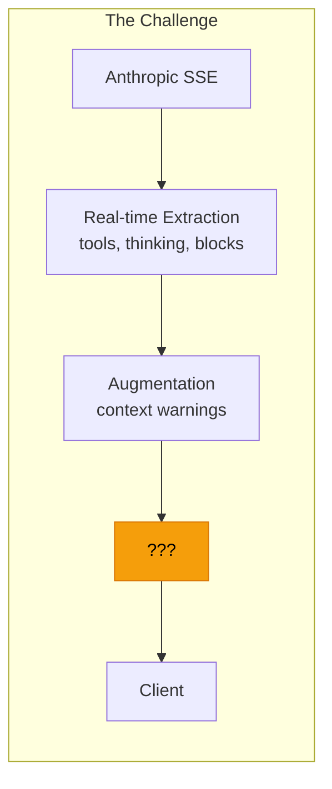
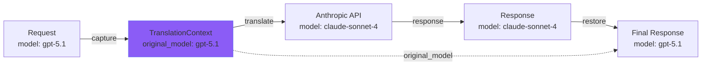

Remember the [first post](/blog/2025/12/welcome-to-aspy/)? Where I mentioned starting with something "completely different"?

> I was working on a proxy to translate between OpenAI and Anthropic v1 APIs. And while it worked—I had it running, streaming SSE and everything—the conversion was *really* tricky due to my limited understanding of the protocols at the time.

That feature is finally complete. Full circle.

## The Detour That Became the Journey

The original plan was simple: build a bidirectional proxy between OpenAI and Anthropic APIs. The *primary* driver? Using other models with Claude Code.

Claude Code speaks Anthropic. It sends requests in Anthropic format, expects Anthropic SSE responses. But what if you want to route those requests to GPT-5.x, Gemini Pro 3 via OpenRouter, a local Ollama model, or any OpenAI-compatible endpoint? You need translation in both directions.

The reverse is useful too—letting OpenAI-compatible tools talk to Claude without rewriting integrations. But the killer use case was always: *Claude Code as a universal AI coding interface*.

I kept hitting edge cases. Streaming was fragile. Tool calls broke mysteriously. Stop reasons mapped incorrectly. The more I dug, the more I realized I didn't *understand* what was flowing through the wire.

So I built Aspy to watch. To observe. To *learn*.

What started as debugging infrastructure became... everything else. The TUI. Session management. Thinking panels. Context warnings. Lifestats. Embeddings. Somewhere along the way, the observability layer became the product.

The translation feature sat dormant. Infrastructure ready, not wired. A TODO comment in `handle_streaming_response()` marking unfinished business.

Until now.

## Why Translation Matters

Here's the thing—Claude Code always uses `stream: true`. That's 95%+ of real traffic. Having buffered translation working without streaming translation is like having a car that only drives in parking lots.

The problem wasn't that streaming translation was *hard*. The problem was that I didn't understand it *deeply enough*.

I had to take the journey. Late nights—past 3 AM not being uncommon—stubborn to figure it out, watching raw SSE flow through the wire. Building parsers, debuggers, visualizers. Learning exactly how Anthropic structures its events—`message_start`, `content_block_delta`, the subtle dance of `index` fields and `stop_reason` timing. Only after developing a rock-solid understanding of Anthropic's protocol could I properly study OpenAI's approach and devise strategies for bidirectional translation.

The result? A translator that handles the hard parts:

- `translate_chunk()` buffers SSE across TCP boundaries
- `translate_sse_data()` maps all Anthropic events to OpenAI format
- `finalize()` emits the `data: [DONE]` terminator

And because I'd built robust core systems along the way, the final integration was smooth. But the code was only possible *because* of the understanding.


<p style="text-align: center; font-size: 0.9em; color: #a1a1aa; margin-top: -10px;"><em>Where does translation fit without breaking existing machinery?</em></p>

Real-time extraction—tool registration, thinking streaming to the TUI, content block indexing—all depends on parsing *raw* Anthropic SSE. Augmentation injects *Anthropic-format* content. If translation happened too early, everything downstream would break.

## The Integration Point

The answer was obvious once I stopped overthinking it: translation happens at the *output* stage.

```mermaid
graph LR
    A[Anthropic SSE] --> RT[Real-time Extraction<br/>on RAW format]
    RT --> AUG[Augmentation Inject<br/>Anthropic SSE]
    AUG --> TR{Translate?}
    TR -->|Yes| TRANS[translate_chunk]
    TR -->|No| RAW[Pass through]
    TRANS --> CLIENT[Client]
    RAW --> CLIENT

    style RT fill:#3f3f46,stroke:#71717a
    style AUG fill:#3f3f46,stroke:#71717a
    style TR fill:#f59e0b,stroke:#d97706
    style TRANS fill:#8b5cf6,stroke:#6366f1
```


<p style="text-align: center; font-size: 0.9em; color: #a1a1aa; margin-top: -10px;"><em>Translation wraps the final output, preserving internal observability</em></p>

Everything internal stays RAW:
- Tool calls get registered immediately (fixing race conditions with the next request)
- Thinking blocks stream to the TUI in real-time
- Block indices track correctly for augmentation injection
- Post-stream parsing still works for event emission

Only the *client-facing output* gets translated. If translation is needed, chunks pass through `translate_chunk()`. If not, they pass through unchanged. The observability layer remains intact.

## The Event Mapping

Anthropic and OpenAI have fundamentally different streaming philosophies:

**Anthropic** sends typed events (`message_start`, `content_block_delta`, `message_delta`). Each event has a clear semantic role.

**OpenAI** sends generic chunks with delta objects. The structure is flatter, more uniform.

The translation maps between these worldviews:

| Anthropic Event | OpenAI Equivalent |
|-----------------|-------------------|
| `message_start` | Initial chunk with `role: "assistant"` |
| `content_block_start` (tool_use) | Tool call header with id, name |
| `content_block_delta` (text) | `choices[].delta.content` |
| `content_block_delta` (input_json) | Tool arguments streaming |
| `content_block_delta` (thinking) | **Filtered out** |
| `message_delta` | `choices[].finish_reason` |
| `message_stop` | `data: [DONE]` |

That "filtered out" row is interesting. Thinking blocks don't exist in OpenAI's format. When translating, they simply disappear from the client-facing stream.

But Aspy still sees them. The TUI still displays them. The spy knows what Claude is thinking, even if the OpenAI-compatible client doesn't.

## The TCP Boundary Problem

Here's something I learned the hard way during the original attempt: SSE events don't respect TCP packet boundaries.

A single Anthropic event might look like this:
```
event: content_block_delta
data: {"type":"content_block_delta","index":0,"delta":{"type":"text_delta","text":"Hello"}}

```

But TCP might deliver it as:
```
Chunk 1: event: content_block_del
Chunk 2: ta\ndata: {"type":"content_block_delta","index":0,"delta":{"type":"text_delta","text":"He
Chunk 3: llo"}}\n\n
```

Three chunks. One event. If you try to parse each chunk independently, you get garbage.

The solution is a line buffer that accumulates across chunk boundaries:

```rust
fn translate_chunk(&self, chunk: &[u8], ctx: &mut TranslationContext) -> Result<Vec<u8>> {
    ctx.line_buffer.push_str(chunk_str);  // Accumulate

    let mut output = Vec::new();
    while let Some(newline_pos) = ctx.line_buffer.find('\n') {
        let line = ctx.line_buffer[..newline_pos].trim().to_string();
        ctx.line_buffer = ctx.line_buffer[newline_pos + 1..].to_string();

        if let Some(data) = line.strip_prefix("data: ") {
            if let Some(translated) = self.translate_sse_data(data, ctx)? {
                output.extend(translated);
            }
        }
    }
    Ok(output)  // May be empty if chunk contained only partial lines
}
```

The function returns empty `Vec<u8>` when it's still buffering. Only complete lines produce output. The caller checks for this and skips sending when there's nothing to send.

This is why the original attempt was fragile. I was trying to translate chunk-by-chunk without understanding that chunks are arbitrary TCP artifacts, not semantic boundaries.

## Error Handling Philosophy

Translation can fail. JSON parsing can fail. Unknown event types can appear. What do you do mid-stream?

Three options:
1. **Abort stream**: Client sees incomplete response. Clean but destructive.
2. **Fall back to raw**: Send untranslated Anthropic SSE. Client might handle it, might not.
3. **Log and skip**: Problematic events disappear. Stream continues.

I chose option 3. Translation is a compatibility layer, not a correctness requirement. If one event fails to parse, log it and move on. The client gets a mostly-complete response rather than a dead connection.

```rust
Err(e) => {
    tracing::warn!("Chunk translation failed (skipping): {}", e);
    None  // Skip this chunk, continue stream
}
```

The log provides debugging visibility. The stream continues. Graceful degradation over rigid failure.

## Model Preservation

One subtle detail: model names need round-tripping.

The client sends `"model": "gpt-5.1"`. We translate to `"model": "claude-sonnet-4-20250514"` for Anthropic. But the response should say `"model": "gpt-5.1"`—what the client originally requested, not what we translated to.

The `TranslationContext` carries `original_model` for exactly this purpose. Request translation captures it. Response translation uses it.


<p style="text-align: center; font-size: 0.9em; color: #a1a1aa; margin-top: -10px;"><em>Context carries original model name through the translation round-trip</em></p>

The client never knows Claude answered. It just sees GPT-5.1 (allegedly) responding to its request.

## Configuration

Translation is opt-in:

```toml
[translation]
enabled = true
auto_detect = true

[translation.model_mapping]
"gpt-5.1" = "claude-sonnet-4-20250514"
"gpt-4o-mini" = "claude-3-haiku-20240307"
```

Format detection happens automatically from path, headers, and body structure. `/v1/chat/completions` is OpenAI. `/v1/messages` is Anthropic. The system figures it out.

Custom model mappings let you control which Claude model responds to which OpenAI model name. The defaults are sensible, but override them if you want Haiku answering GPT-5 requests (you probably don't, but you could).

## The Bootup Banner

With this feature complete, the startup banner now shows:

```
  Loading modules...
  ─ Pipeline ─
    ✓ ctx-warn      Context warnings
    ✓ stats         Token tracking
    ✓ thinking      Thinking panel
    ✓ translation   API translation
```

A small checkmark. A lot of history.

## Full Circle

I started building Aspy to understand why translation was breaking. I ended up building an observability suite, a TUI, session management, context recovery, semantic search.

The translation feature that triggered all of this sat unfinished—a TODO comment mocking me through countless late nights.

Now it's done. Streaming works. Tool calls translate correctly. Stop reasons map properly. The understanding I gained by building everything else made the final integration almost trivial—40 lines of code in the streaming handler.

Sometimes the scenic route is the only route.

```mermaid
graph TB
    subgraph "The Journey"
        START[Translation Proxy<br/>Original Goal] -->|"too fragile"| OBS[Build Observability<br/>to understand]
        OBS -->|"scope creep"| TUI[TUI, Sessions,<br/>Stats, Themes]
        TUI -->|"context loss"| LS[Lifestats<br/>SQLite Storage]
        LS -->|"keywords aren't enough"| EMB[Embeddings<br/>Semantic Search]
        EMB -->|"full understanding"| TRANS[Translation<br/>Finally Complete]
    end

    START -.->|"months later"| TRANS

    style START fill:#ef4444,stroke:#dc2626,color:#fff
    style TRANS fill:#10b981,stroke:#059669,color:#fff
    style OBS fill:#3f3f46,stroke:#71717a
    style TUI fill:#3f3f46,stroke:#71717a
    style LS fill:#3f3f46,stroke:#71717a
    style EMB fill:#3f3f46,stroke:#71717a
```


<p style="text-align: center; font-size: 0.9em; color: #a1a1aa; margin-top: -10px;"><em>The scenic route from translation → observability → back to translation</em></p>

## What This Enables

With bidirectional translation working, Aspy becomes a universal bridge:

**Claude Code → Other Models (primary use case):**
- Point Claude Code at Aspy, point Aspy at OpenAI/Azure/OpenRouter/Ollama
- Claude Code's Anthropic requests translate to OpenAI format
- OpenAI responses translate back to Anthropic format
- *Claude Code becomes a universal AI coding interface*

**Other Tools → Claude (reverse direction):**
- **LangChain** with OpenAI provider settings can route through Aspy to Claude
- **OpenAI Python SDK** works if you set `base_url` to Aspy
- **Any tool** expecting `/v1/chat/completions` now speaks Claude

**Both directions** fully observable—every tool call, every thinking block, every token.

The spy speaks both languages now. And it remembers everything said in either one.

---

## Testing It

```bash
# Enable translation
cat >> ~/.config/aspy/config.toml << 'EOF'
[translation]
enabled = true
auto_detect = true
EOF

# Start Aspy
aspy

# Send OpenAI-format request
curl http://localhost:8080/dev-1/v1/chat/completions \
  -H "Content-Type: application/json" \
  -H "Authorization: Bearer $ANTHROPIC_API_KEY" \
  -d '{
    "model": "gpt-5.1",
    "messages": [{"role": "user", "content": "Hello!"}],
    "stream": true
  }'
```

You'll see OpenAI-format SSE streaming back. The TUI will show Claude's thinking blocks (if extended thinking is on). The request logs will show the translation happening.

Two formats. One spy. Full visibility.

---

## What's Next

Translation is experimental. Fun, exploratory, a playground for understanding how different models behave. It'll stay that way until the core is rock solid.

And that core? It's coming together faster than I expected.

Yesterday, chaos. A stray `sed` command—don't ask—wrecked an implementation. I was distracted, let Claude run it without thinking. Files everywhere. Eventually we got things stable and I triggered a compact. Fresh Claude arrives: *"Where were we?"*

I started explaining. Then caught myself mid-sentence.

Wait. I built tools for this.

I described what we'd been doing and asked Claude to use the hybrid search. Paraphrasing, fuzzy details, half-remembered keywords. Claude ran three MCP calls with different variations of what I'd explained.

And *found it*. The exact conversation. Restored the full todo list. Marked completed steps as done. Ready to continue.

The tool worked in practice. Four cents of embeddings across 2 million tokens. Worth it.

This is just the start.

The transformer pipeline shipped this week—request modification before it hits Anthropic. With the tag editor, you have agency over what `<system-reminder>` tags say, what policy tags exist, what context Claude sees. Custom injections aligned with your workflow. Aspy as a Claude Code extension platform, not just an observer.

Next up is completing the layer architecture. Transformer, Translator, Event Pipeline, Augmentor—each one a pluggable pipeline built on mpsc channels. Non-blocking. Minimal latency. The foundation for everything else: custom augmentors, storage backends, tracing integrations.

There's even a CompactTransformer in the works. Claude Opus 4.5 is helping me analyze Anthropic's native compaction strategy—finding gaps, suggesting optimizations. The goal: better continuity after automatic compaction. (Claude has, hilariously, already critiqued aspects of the current approach. And between you and me? The spy knows Claude finds those TODO-list reminders annoying.)

The translation layer is fun. A side quest. It gives you freedom to observe other models, compare behaviors, explore. But it's not the main track.

The main track is agency. Over context. Over what Claude sees and how it responds. Over the continuity between sessions and the flow state that makes vibe coding possible.

Aspy started as a debugging tool for a translation proxy. It became an observability suite. Now it's becoming something else—a platform for owning the conversation between you and Claude.

You're already the frontend. Aspy just makes that visible.
