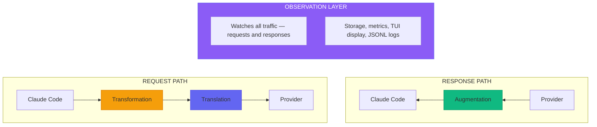

Two weeks ago, Aspy was an observability proxy. Watch tool calls. See thinking blocks. Track tokens.

Today, it's something more: a platform for owning the conversation between you and Claude.

v0.2.0 lands with four architectural layers working in harmony, each solving a different problem in the Claude Code experience.

## The Stack


<p style="text-align: center; font-size: 0.9em; color: #a1a1aa; margin-top: -10px;"><em>The four layers: Observation wraps everything, watching both directions</em></p>

**Observation** watches all traffic — requests and responses. The spy sees everything. Storage to SQLite, metrics aggregation, TUI display, JSONL logs. All composable, all non-blocking.

**Transformation** modifies requests before they leave. TagEditor lets you inject, remove, or replace XML-style tags conditionally. CompactEnhancer detects compaction prompts and injects continuity guidance.

**Translation** converts between API formats. Claude Code speaks Anthropic—but now it can route to any OpenAI-compatible backend: GPT-5.x, Gemini via OpenRouter, local Ollama models. Full bidirectional streaming.

**Augmentation** injects content into SSE streams. Context warnings at 60%, 80%, 90% thresholds. More augmentors planned.

Each layer is independent. Each is config-toggleable. The kernel/userland separation means features compose without coupling.

---

## What's New Since v0.1.0

### Request Transformers

Edit what Claude sees before Anthropic does.

```toml
[transformers]
enabled = true

[transformers.tag-editor]
enabled = true

# Inject context on conversational turns
[[transformers.tag-editor.rules]]
type = "inject"
tag = "aspy-context"
content = "Recovery tools available via aspy_recall"
position = "end"
when = { has_tool_results = "=0" }

# Remove noisy reminders after turn 2
[[transformers.tag-editor.rules]]
type = "remove"
tag = "system-reminder"
pattern = "Learning output style"
when = { turn_number = ">2" }
```

**Conditional rules** fire based on turn number, tool result count, or client ID. Use `every:N` for periodic injection.

**CompactEnhancer** is the first content-aware transformer. It detects Anthropic's compaction prompt and appends instructions for better continuity—active work tracks, key decisions, searchable keywords. The summarizing Claude writes a handoff note; the continuing Claude reads it and picks up the baton.

### API Translation

Claude Code becomes a universal interface.

```toml
[translation]
enabled = true
auto_detect = true

[translation.model_mapping]
"gpt-5.1" = "claude-sonnet-4-20250514"
```

Point Claude Code at Aspy, point Aspy at any OpenAI-compatible endpoint. Requests translate from Anthropic format to OpenAI; responses translate back. Streaming works. Tool calls work. The client never knows Claude answered—it just sees GPT-5.1 (allegedly) responding.

The reverse direction works too: LangChain, OpenAI Python SDK, any `/v1/chat/completions` client can route through Aspy to Claude.

### Semantic Search

Keywords aren't enough. Sometimes you remember the *concept* but not the *term*.

```toml
[embeddings]
provider = "remote"
model = "text-embedding-3-small"
api_base = "https://api.openai.com/v1"
```

The embedding indexer runs in the background, converting your session history into vectors. Hybrid search combines semantic similarity with FTS5 keyword matching using Reciprocal Rank Fusion.

Search for "auth" and find discussions about "login," "JWT," "sessions." Four cents to embed 2 million tokens. Worth it.

**Providers supported:** OpenAI, Azure OpenAI, Ollama, local MiniLM (with `--features local-embeddings`).

### Cortex Database

What started as "lifestats" (lifetime statistics) grew into something bigger. The database now handles sessions, todo tracking, embeddings, and context recall—far beyond just stats. We renamed it **Cortex** to reflect its expanded role as Aspy's memory layer.

Every event flows to SQLite. FTS5 indexes on thinking blocks, prompts, responses. User-scoped queries. Cross-session context recovery.

```bash
# Check indexer status
aspy embeddings --status

# Force reindex
aspy embeddings --reindex
```

The MCP tools give Claude direct access:

| Tool | Purpose |
|------|---------|
| `aspy_recall` | Best—semantic + keyword search |
| `aspy_recall_thinking` | Search past reasoning |
| `aspy_recall_prompts` | Search your questions |
| `aspy_recall_responses` | Search Claude's answers |
| `aspy_lifetime` | Lifetime token/cost breakdown |

Context recovery becomes a millisecond operation. No more jq archaeology.

### File Logging

Structured logs with rotation:

```toml
[logging]
level = "debug"
file_enabled = true
file_dir = "~/.local/share/aspy/logs"
file_rotation = "daily"  # or "hourly", "never"
file_prefix = "aspy"
```

Creates files like `aspy.2024-01-15.log`. JSON format for easy analysis.

### TUI Improvements

- **Zoom mode** (`z` key) — expand any panel to full screen, Tab cycles while zoomed
- **`g`/`G` keybinds** for top/bottom navigation
- **Enhanced markdown rendering** with bold, italic, tables, blockquotes
- **2D scrolling** for JSON content in detail views
- **Token tracking** for transformers — see tokens added/removed by each rule
- **TrackedEvent** wraps events with user/session context
- **Better focus hints** showing available keybinds

### OpenTelemetry Export

Export telemetry to Azure Application Insights for enterprise observability:

```toml
[otel]
enabled = true
connection_string = "InstrumentationKey=xxx;IngestionEndpoint=https://..."
```

Every API request, tool call, token usage event, and transformation gets exported as an OTel span. Build dashboards, set up alerts, correlate with other services.

See the [OpenTelemetry Guide]({{ '/otel-guide' | relative_url }}) for setup and Azure Workbook examples.

### System Editor

A new transformer for modifying system prompts:

```toml
[transformers.system-editor]
enabled = true

[[transformers.system-editor.rules]]
type = "append"
content = "\n\nYou are augmented by Aspy observability."

[[transformers.system-editor.rules]]
type = "replace"
pattern = "Claude Code"
replacement = "Claude Code (Aspy-enhanced)"
```

Append, prepend, or regex-replace content in the system prompt. Use it for global context injection, branding, or updating references.

### Todo History

Track Claude's task lists across sessions:

```bash
curl "http://127.0.0.1:8080/api/cortex/todos?q=refactor"
```

When Claude calls `TodoWrite`, Aspy captures a snapshot with FTS indexing. Recall what you were working on after compaction wipes your context.

### Context Recovery Detection

Aspy now detects when Claude Code silently "crunches" tool results to recover context—separate from manual `/compact`:

```
ContextRecovery detected:
  tokens_before: 180,000
  tokens_after: 150,000
  percent_recovered: 16.7%
```

This visibility helps explain unexpected context behavior during long sessions.

### Identity & Session APIs

New endpoints for session management:

- `GET /api/whoami` — Discover your user ID and current session
- `GET /api/session-history` — Browse past sessions with stats

```bash
curl http://127.0.0.1:8080/api/whoami -H "x-api-key: $ANTHROPIC_API_KEY"
curl "http://127.0.0.1:8080/api/session-history?user=b0acf41e12907b7b&limit=10"
```

---

## The Story

v0.1.0 was observation. See what's happening. Track tokens. Watch thinking blocks.

v0.2.0 is agency. Modify requests. Translate formats. Recover context. Enhance compaction.

The journey from "debugging tool" to "platform" happened faster than expected. Each feature built on the last:

1. **Observation** gave us structured processing
2. **Cortex** gave us queryable history
3. **Embeddings** gave us semantic search
4. **Transformers** gave us request modification
5. **Translation** gave us format interoperability
6. **CompactEnhancer** gave us continuity through compaction

The layers stack. The architecture holds. Features compose without coupling.

---

## Breaking Changes

None. v0.2.0 is additive. Existing configs work unchanged.

New features are opt-in:
- `[transformers]` disabled by default
- `[translation]` disabled by default
- `[embeddings]` provider defaults to `"none"`

---

## What's Next

The foundation is solid. Now comes the interesting work:

- **Cost estimation transformer** — Detect expensive operations, inject warnings
- **Workflow hints** — Recognize patterns, suggest tools
- **Safety rails** — Detect risky operations, require confirmation
- **Custom augmentors** — User-defined content injection
- **Metrics export** — Prometheus-compatible metrics alongside OTel traces
- **Session reconnection** — Resume sessions across Claude Code restarts

The kernel/userland separation means these features slot in cleanly. Each one is independent, testable, config-toggleable.

---

## Try It

```bash
# Download or build
cargo install --git https://github.com/omgpointless/aspy

# Run
./aspy

# Point Claude Code at it
export ANTHROPIC_BASE_URL=http://127.0.0.1:8080
claude
```

For the new features:

```bash
# Enable transformers
cat >> ~/.config/aspy/config.toml << 'EOF'
[transformers]
enabled = true

[transformers.compact-enhancer]
enabled = true
EOF

# Enable semantic search
cat >> ~/.config/aspy/config.toml << 'EOF'
[embeddings]
provider = "remote"
model = "text-embedding-3-small"
api_base = "https://api.openai.com/v1"
EOF

export ASPY_EMBEDDINGS_API_KEY="sk-..."
```

The spy sees everything. Now it speaks both languages, modifies what it carries, and remembers what Claude forgot.

---

## Documentation

| Guide | What It Covers |
|-------|----------------|
| [Request Transformers]({{ '/transformers' | relative_url }}) | TagEditor, SystemEditor, CompactEnhancer, conditional rules |
| [API Translation]({{ '/api-translation-guide' | relative_url }}) | Bidirectional OpenAI/Anthropic conversion |
| [Semantic Search]({{ '/semantic-search-guide' | relative_url }}) | Embedding providers, hybrid search |
| [OpenTelemetry]({{ '/otel-guide' | relative_url }}) | Azure Application Insights, span export |
| [CLI Reference]({{ '/cli-reference' | relative_url }}) | Config options, embeddings commands |
| [API Reference]({{ '/api-reference' | relative_url }}) | REST endpoints including whoami, session-history |

Full changelog in the repository.
