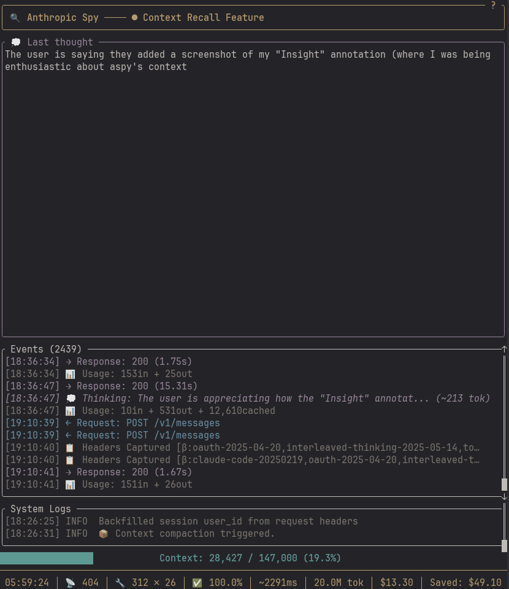
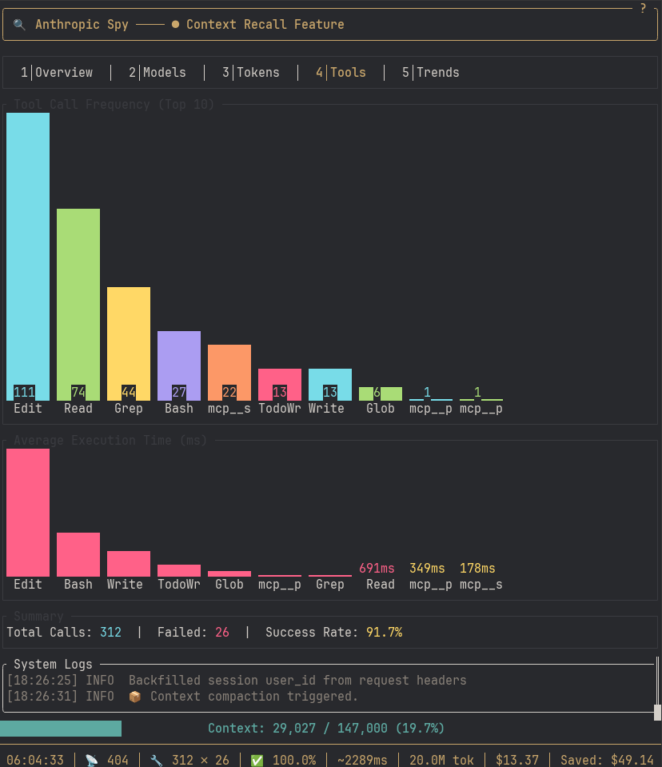
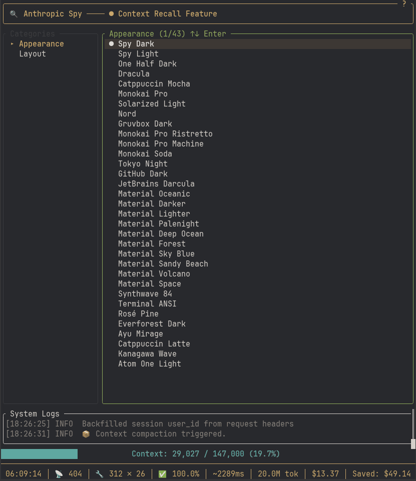

# Features

A detailed look at what Aspy can do.

## Real-time Thinking Panel

Watch Claude's reasoning stream word-by-word as it thinks through problems. The dedicated thinking panel shows extended thinking blocks in real-time, not after the fact.

- Streams incrementally as tokens arrive
- Dedicated panel keeps thinking visible while events scroll
- Renders markdown with inline code and code block highlighting



## Stats Dashboard

Session analytics at a glance with ratatui widgets:

- **Bar charts** — Token distribution (cached vs input vs output)
- **Gauges** — Context window usage with color-coded thresholds
- **Sparklines** — Token usage trends over time
- **Tool breakdown** — Call counts and average durations

Press `s` to switch to Stats view, `Tab` to cycle through tabs.



## Context Recall

Search across all your past sessions. When compaction wipes context, the logs remain.

- **Full-text search** across session history
- **Query from Claude** via MCP tools (`aspy_search`)
- **Recover decisions** — find why you made that architectural choice 3 weeks ago
- **Cross-session continuity** — new Claude instances can recall what previous ones discovered

This isn't just logging—it's a searchable memory of your AI-assisted development journey.


> **Coming soon:** Local SQLite storage for faster querying and smarter context management. JSONL files will remain for portability; SQLite adds efficient indexing for recall at scale.

## Context Warnings

<!-- TODO: Add screenshot -->

Automatic notifications when your context window fills up:

```
⚠️ Context at 80% - consider using /aspy:tempcontext
```

Configurable thresholds (default: 60%, 80%, 85%, 90%, 95%) inject helpful reminders into Claude's responses suggesting when to compact.

```toml
[augmentation]
context_warning = true
context_warning_thresholds = [60, 80, 85, 90, 95]
```

### Preparing for Compact

When it's time to compact, use the `/aspy:tempcontext` command. This:

1. Creates a temporary context file summarizing your current tangent and direction
2. Provides compact instructions you can copy and run
3. The context file itself adds weight to what gets preserved during compaction

The result is generally quality context retention. For any gaps, use `aspy_search` to recall details from the session logs.

> **Future:** I'm exploring ways to automate this into a single command.

## Theme System

32 bundled themes plus custom TOML support:

**Bundled themes include:**
- Spy Dark / Spy Light (flagship)
- Dracula, Nord, Gruvbox, Monokai Pro
- Catppuccin (Mocha, Latte)
- Tokyo Night, Synthwave '84
- And many more...



**Custom themes:** Drop a `.toml` file in `~/.config/aspy/themes/` with your colors.

Press `F3` for Settings, navigate to theme, press `Enter` to apply. Changes persist to config.

See [Themes documentation](themes.md) for creating custom themes.

## Multi-Client Routing

<!-- TODO: Add diagram -->

Track multiple Claude Code instances through a single proxy:

```toml
[clients.dev-1]
name = "Dev Laptop"
provider = "anthropic"

[clients.work]
name = "Work Projects"
provider = "foundry"

[providers.anthropic]
base_url = "https://api.anthropic.com"

[providers.foundry]
base_url = "https://{resource}.services.ai.azure.com"
```

Connect via URL path:
```bash
# Personal projects via Anthropic API
export ANTHROPIC_BASE_URL=http://127.0.0.1:8080/dev-1
claude

# Work projects via Foundry
export ANTHROPIC_FOUNDRY_BASE_URL=http://127.0.0.1:8080/work
export ANTHROPIC_FOUNDRY_API_KEY=your-foundry-key
claude
```

Each client gets isolated session tracking. Query specific clients via API:
```bash
curl http://127.0.0.1:8080/api/stats?client=dev-1
curl http://127.0.0.1:8080/api/stats?client=work
```

See [Multi-Client Routing](sessions.md) for full configuration.

## Structured Logs

JSON Lines format for easy analysis:

```bash
# Count tool calls by type
jq -r 'select(.type=="tool_call") | .tool_name' logs/*.jsonl | sort | uniq -c

# Find slow tool calls (>5s)
jq 'select(.type=="tool_result" and .duration.secs > 5)' logs/*.jsonl

# Calculate cache efficiency
jq -s '[.[] | select(.type=="ApiUsage")] |
  (map(.cache_read) | add) as $cached |
  (map(.input_tokens) | add) as $input |
  {cache_ratio: (($cached / ($cached + $input)) * 100)}' logs/*.jsonl
```

See [Log Analysis](log-analysis.md) for more queries.

## REST API

Programmatic access to session data:

| Endpoint | Description |
|----------|-------------|
| `GET /api/stats` | Session statistics |
| `GET /api/events` | Recent events |
| `GET /api/context` | Context window status |
| `GET /api/sessions` | All tracked sessions |
| `POST /api/search` | Search past logs |

All endpoints support `?client=<id>` for multi-client filtering.

See [API Reference](api-reference.md) for full documentation.

## Slash Commands

Quick access to session data without leaving your flow:

| Command | Description |
|---------|-------------|
| `/aspy:stats` | Token counts, costs, cache efficiency at a glance |
| `/aspy:context` | Context window status and warning level |
| `/aspy:events` | Recent tool calls and results |
| `/aspy:tempcontext` | Prepare context for compaction (see [Context Warnings](#context-warnings)) |

## MCP Integration

Query session data programmatically from within Claude Code:

```bash
claude mcp add aspy -- npx -y aspy-mcp
```

Available tools:
- `aspy_stats` — Token counts, costs, cache efficiency
- `aspy_events` — Recent tool calls and results
- `aspy_context` — Context window percentage and warnings
- `aspy_search` — Search past session logs

## Keyboard Navigation

| Key | Action |
|-----|--------|
| `e` / F1 | Events view |
| `s` / F2 | Stats view |
| F3 | Settings view |
| `↑`/`↓` or `j`/`k` | Navigate |
| `Enter` | Open detail / Apply |
| `Escape` | Close / Back |
| `Tab` | Cycle focus / tabs |
| `q` | Quit |
